# Development Environment Setup

## Requirements
1. Install [JADE](https://jade.tilab.com/download/jade/). Download and unzip jadeAll folder.
2. Install [Eclipse](https://www.eclipse.org/downloads/) 
3. Install [Drools](https://www.drools.org/download/download.html) (Specifically the newest version of "Drools and jBPM tools" as it is the Eclipse plug in). Make sure to [install](https://www.tutorialspoint.com/drools/drools_eclipse_plugin.htm) it within eclipse after downloading.


## Clone Repo Into Eclipse
1. [Code repo](https://github.optum.com/kkalyan7/PriorAuthModel)


2. **Import project from git**

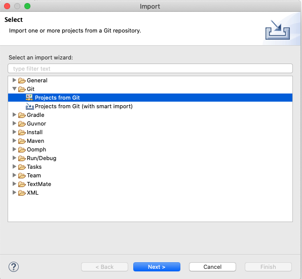
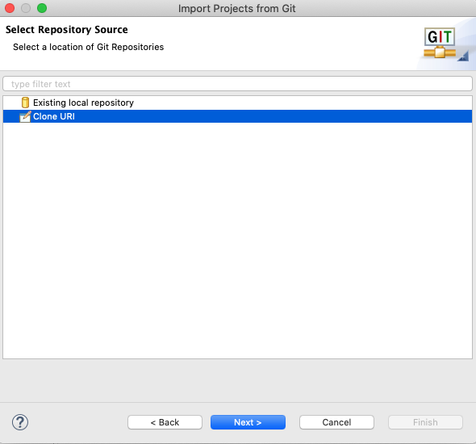
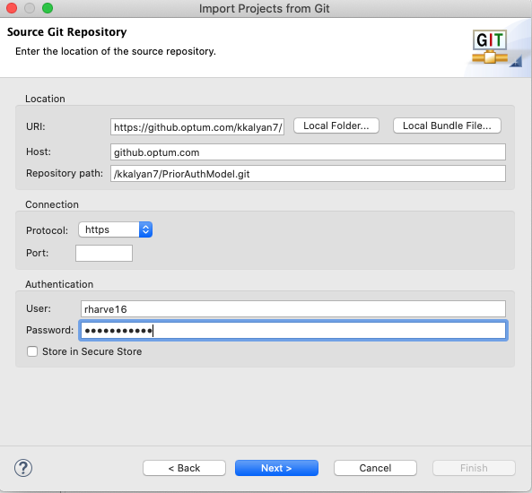
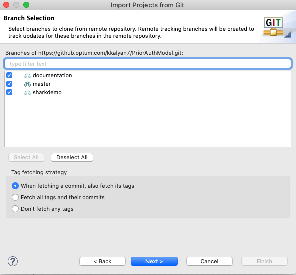
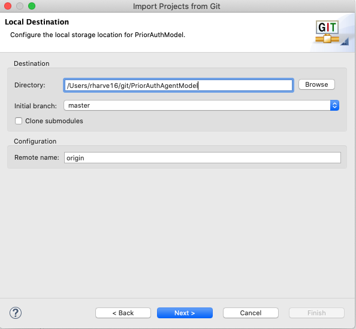
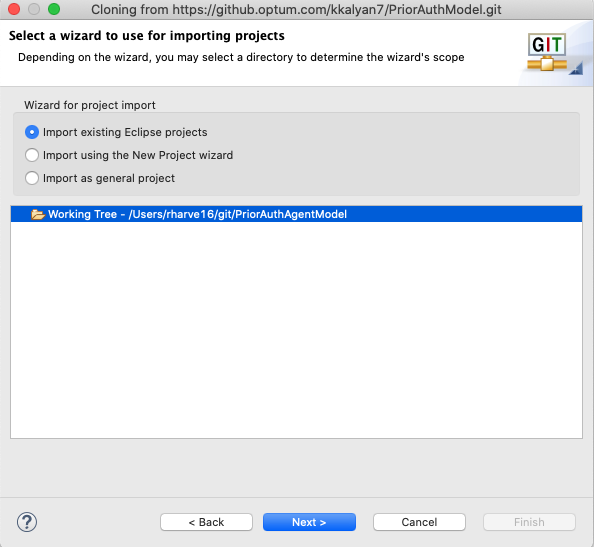
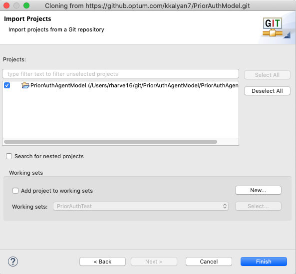


3. **Set build path**

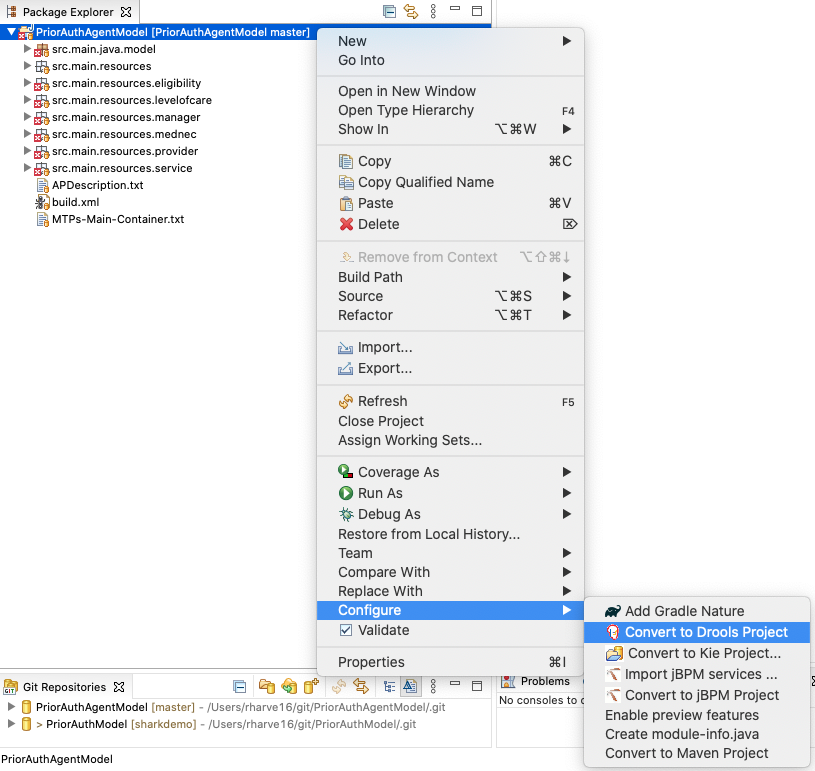

First, convert the project to a Drools project.

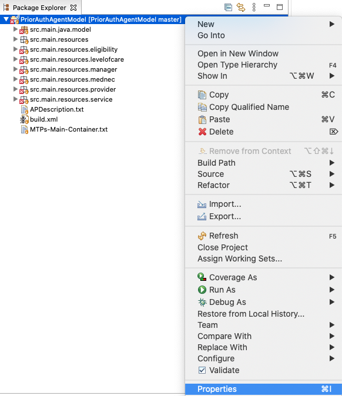

Open Properties menu to configure build path.

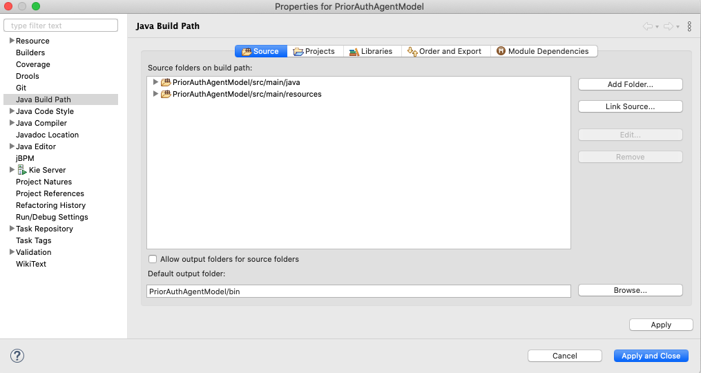

Remove the existing source folder and add `src/main/java` and `src/main/resources` as source folders.

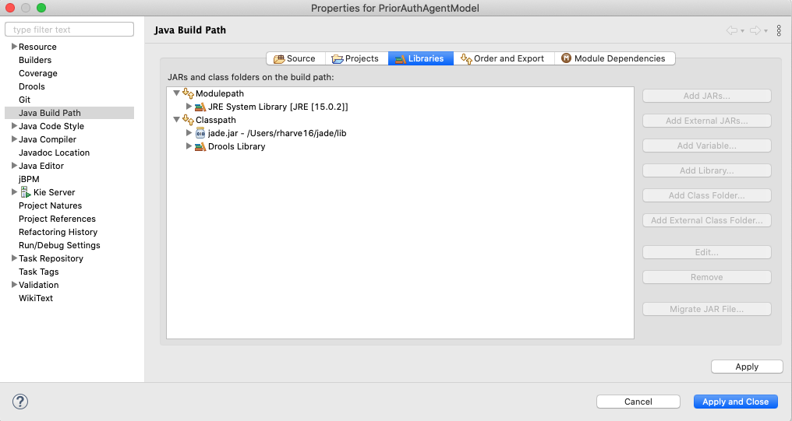

Drools Library should already be in the classpath if project was converted correctly. Add jade.jar into the classpath as an external jar. Add JRE if missing.
Click Apply and Close.

4. **Set run configurations**
    
    Create a new run configuration. Set Main class to `jade.Boot` this is reguired for any Jade run configuration. Arguments can be customized as needed. Currently, the following arguments are used to run all the agents at once in the same container:
    
    ```-gui -container-name "PriorAuth" -agents "Eligibility:model.EligibilityAgent;Manager:model.ManagerAgent;MedNec:model.MedNecAgent;Providers:model.ProviderAgent;Service:model.ServiceAgent;LevelOfCare:model.LevelOfCareAgent"```
    